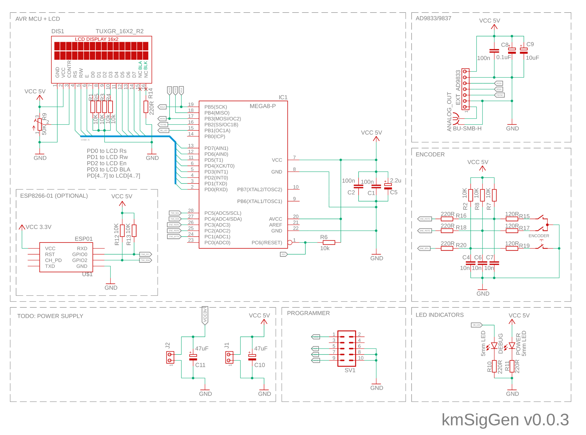

# kmSigGen
DDS Generator based on AD9833 and ATMega8A with WiFi support via ESP8266-01

Main features:
* generates square (5Vp-p), sine and triangle(0.6Vp-p) waves in the ~0.1Hz to 12.5MHz frequency range (with ~0.1Hz step regulation)
* user interface based on LCD 16x2 and single rotary encoder with button
* possibility to store and recall 4 presets
* possibility to control device via TWI/I2C interface
* optional ESP8266-01 module for controlling device via WWW (e.g. from mobile phone)
* localization (available English and Polish language)
* screen saver (when available in LCD)
* easy configuration process with single conifg.h file (with possibility to disable some modules)
* project files available for AtmelStudio7 and Eclipse 

Components:
* ATmega8A MCU @ 8MHz
* AD9833/9837 assembled module @ 25MHz
* LCD 16x2 screen
* rotary encoder with button
* resistors, capacitors, connectors as defined on schematics view
Optional components:
* ESP8266-01 module
* 2 x LED (power and debug)

